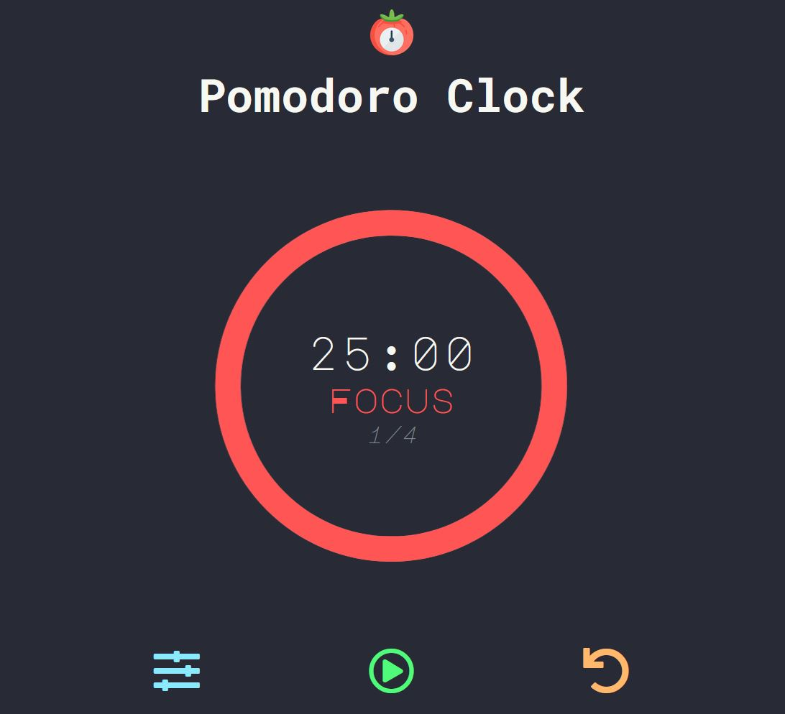

<h1 align="center">  
   
  
   
Pomodoro Clock  
   
</h1>  

<h4 align="center">Site affichant un timer "Pomodoro", développé avec HTML, CSS & JavaScript.</h4>

  

  
  
---  

  
  <a href="https://choupal.github.io/pomodoro-clock/">Visiter le site</a>  

  
  
---

  

## Screenshots

  
  
---  

  <a href="https://github.com/choupal">
    Choupal
  </a>

   
   

  

   

 
  
---
